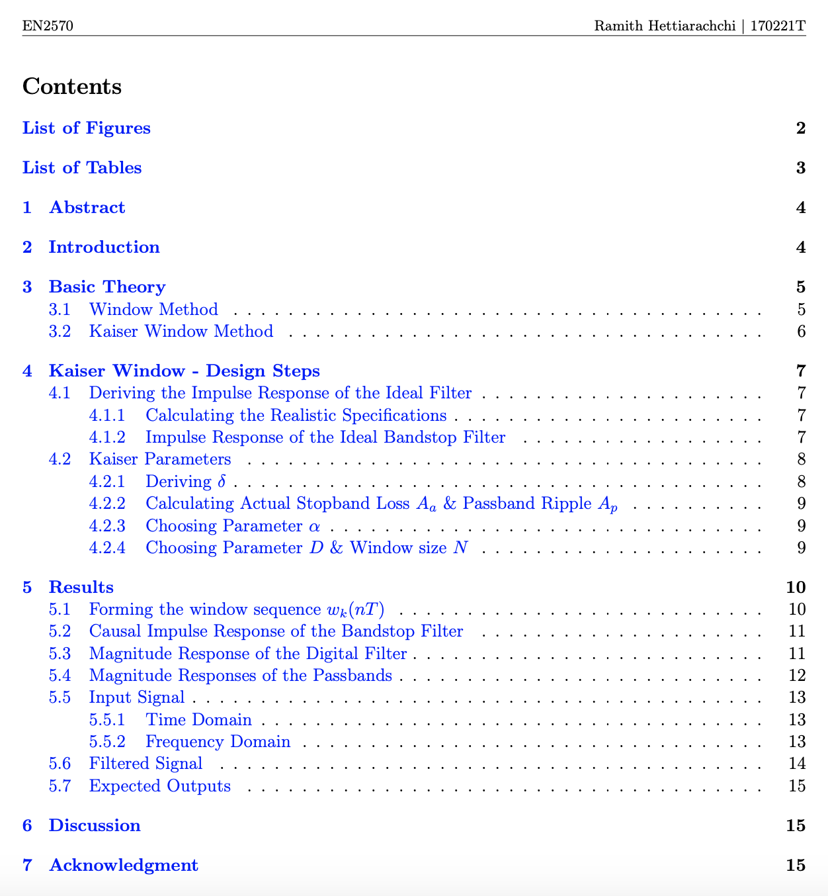
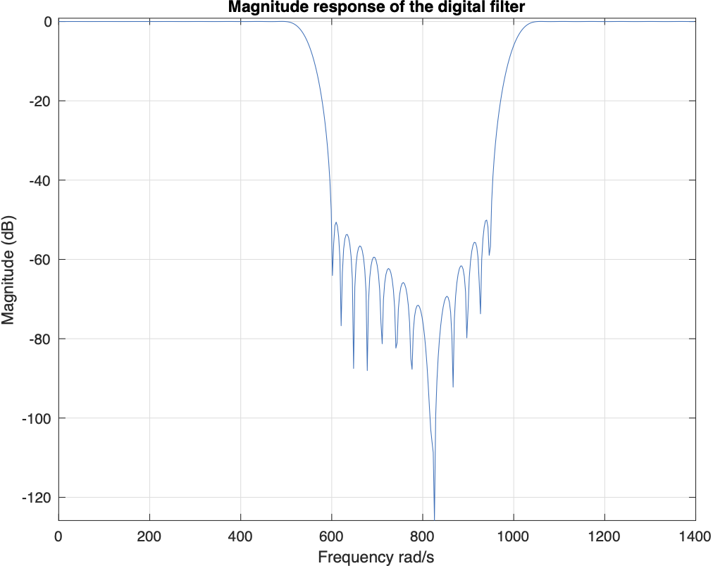

BandStop-FIR-Filter-Design

Digital filters play a major role in a vast variety of fields. Thus, it is important to understand the fundamental concepts of filter design. In this project, the objective is to get hands on experience building a Finite Impulse Response(FIR) Filter.

## Table of Contents:

view the full report [here](https://github.com/ramithuh/BandStop-FIR-Filter-Design/blob/master/FIR_Report/170221T.pdf)

